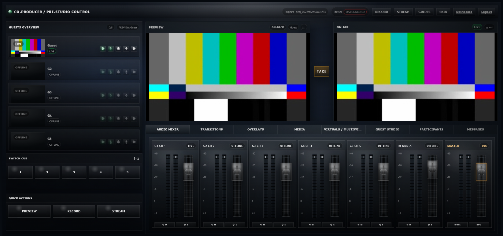
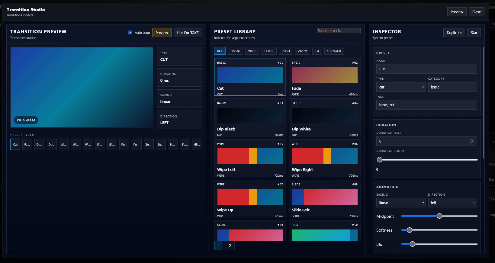
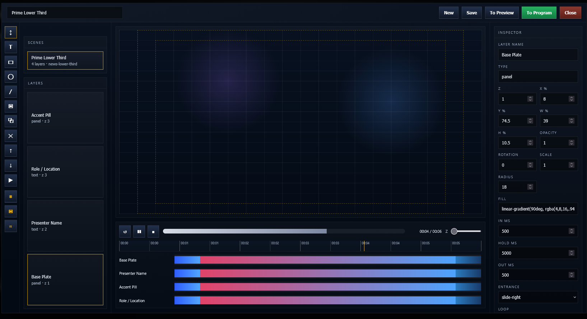
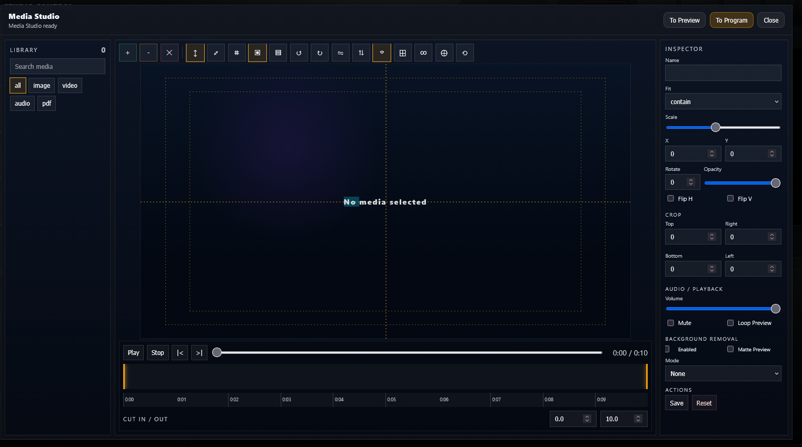
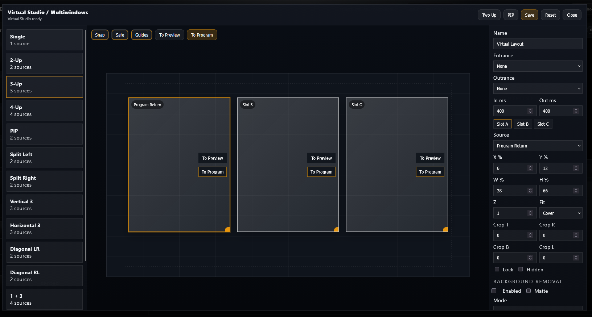

# 🎬 Live Broadcast Co-Producer Studio

A **real-time browser-based broadcast control system** built to replicate professional live production workflows (similar to vMix / OBS control surfaces).

This platform enables full control of:

* 🎥 video switching (Preview → Program TAKE)
* 🎚️ audio mixing with live meters
* 🎞️ transitions and effects
* 🎨 overlays and graphics composition
* 📂 media playback and editing
* 🧩 multi-source layouts (virtual studio)

---

## 🚀 Main Studio (Control Surface)

The central interface for live production control, including Preview/Program workflow, guest monitoring, and audio mixer.



---

## 🎞️ Transition Studio

Preset-driven transition system with full control over timing, easing, and direction.



* Cut, Fade, Wipe, Slide, Zoom, FX
* Live preview before applying
* “Use for TAKE” broadcast workflow

---

## 🎨 Overlay / Graphics Composer

Layer-based system for creating broadcast graphics such as lower thirds and titles.



* Multi-layer composition (text, shapes, panels)
* Timeline-based animation
* Safe-area grid + snapping
* Real-time preview rendering

---

## 🎥 Media Studio

Media playback and editing environment.



* Video / image / audio playback
* Timeline trimming (IN / OUT)
* Transform controls (scale, crop, rotation)
* Background removal (AI / chroma-ready)

---

## 🧩 Virtual Studio / Multiview

Flexible layout engine for multi-source composition.



* PiP, 2-up, 3-up, 4-up layouts
* Slot-based composition system
* Per-slot Preview / Program routing
* Dynamic positioning and scaling

---

## 🧠 Architecture


### System Flow

Frontend UI (JavaScript)
→ PHP Token API
→ LiveKit (WebRTC transport)
→ MediaMTX / FFmpeg (RTMP processing)
→ Output Streams

---

## ⚙️ Tech Stack

**Frontend**

* JavaScript (modular architecture)
* HTML5 / CSS3 (custom UI system)

**Backend**

* PHP (token API, system orchestration)

**Streaming**

* LiveKit (WebRTC)
* MediaMTX (RTMP ingestion)
* FFmpeg (media processing)

**Optional**

* MySQL (project / asset storage)

---

## ⚡ Key Engineering Highlights

* Designed **real-time Preview → Program switching pipeline**
* Built **WebRTC orchestration layer** with stable reconnect logic
* Implemented **multi-layer rendering engine** (media + overlays)
* Solved **participant/track synchronization issues**
* Created **modular broadcast UI system**
* Developed **token-based secure streaming integration**

---

## ⚠️ Configuration

This project depends on external services:

* LiveKit server
* MediaMTX (RTMP)
* FFmpeg

All credentials, secrets, and production endpoints have been removed.

Use:

```bash
config/example.env
```

to configure your environment.

---

## 📌 Purpose

This project demonstrates:

* real-time system design
* streaming infrastructure engineering
* full-stack architecture
* broadcast-grade UI/UX implementation

---

## 🔐 Disclaimer

This repository is a **sanitized public version** of a production system.

* No sensitive data included
* No API keys or secrets exposed
* No private infrastructure details

---

## 👤 Author

**Stephen Kaihula**
Full Stack Systems Engineer
Real-time Streaming • Backend Infrastructure • Scalable Platforms

---
